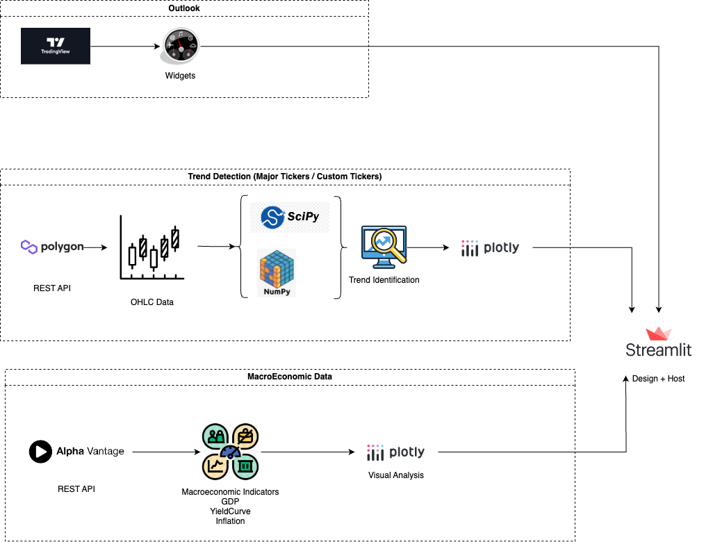

## Description:
Introducing the MacroEconomic Dashboard App: Your one-stop solution for monitoring major macroeconomic indicators and gaining valuable insights into stocks and ETFs. This dynamic dashboard offers a comprehensive overview of market movements, along with specialized features for on-demand trend analysis.

Our goal in designing this dashboard was to create a centralized platform that consolidates all relevant market data, making it effortless for users to stay informed about ticker trends and market dynamics. With just a glance, you can access crucial macroeconomic indicators and track the performance of your preferred stocks and ETFs.

To enhance your experience, we've incorporated custom functionality that enables you to perform trend analysis at your convenience. This feature empowers you to delve deeper into specific stocks and ETFs, uncovering valuable patterns and making informed decisions.

Don't miss out on this powerful tool for navigating the complex world of macroeconomics and capital markets. Access the MacroEconomic Dashboard App today and gain a competitive edge in understanding and capitalizing on market trends.

Visit the following link to explore the MacroEconomic Dashboard App: https://macroeconomic-outlook.streamlit.app/

## Tabs
    - Outlook (General Trading View Widgets)
    - Sector Trends / Ticker Trends (Custom indicator to detect asset's direction)

## Pattern:

